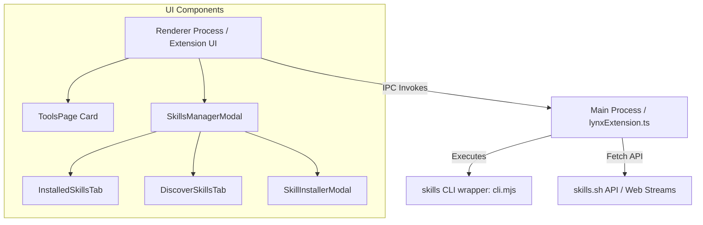

# LynxHub Skills Manager (lynxhub-skills-toolkit)

The **LynxHub Skills Manager** is a built-in extension (`lynxhub-skills-toolkit`) designed to manage and discover reusable instruction packages (skills) for AI coding agents (such as Antigravity, Claude Code, Cursor, etc.). It acts as a GUI wrapper around the `skills` NPM CLI package, integrating seamlessly with the [skills.sh](https://skills.sh) registry.

---

## Architecture Diagram



---

## Key Features

1. **Local & Global Listing**: View installed agent skills, grouping them by parent directory, target scope (Project-scoped or Global), or targeted agents.
2. **Registry Discovery**: Stream and parse live categories (Trending, Hot, All-Time) and official creators directly from [skills.sh](https://skills.sh).
3. **Registry Search**: Perform live queries against the registry to search for available skills.
4. **Security Audits**: Fetch safety audits (passes/warnings/failures) for specific registry packages before installing them.
5. **Interactive Installer**: Configure the installation scope (`project` vs. `global`), installation method (`symlink` vs. `copy`), and target agents (e.g. `Antigravity`, `Claude Code`, or all `*`).

---

## Architectural Components

### 1. Main Process Extension Controller

Located in [lynxExtension.ts](file:///d:/Programming/LynxHub/extension/src/main/lynxExtension.ts), the entrypoint [initialExtension](file:///d:/Programming/LynxHub/extension/src/main/lynxExtension.ts#L190) wires up the IPC event handlers:

- **CLI Wrapper**: Executes command args using node's `child_process.exec` against the bundled `skills/dist/cli.mjs` entry point under the current `process.execPath`.
- **Discover Streams Parser**: Resolves Next.js server component stream responses (`__next_f.push` payloads) from [skills.sh](https://skills.sh) to scrape dynamic categories like Hot, Trending, and Official creators.
- **Registry Queries**: Calls backend search endpoints and audit checks via the native Node `fetch` API.

### 2. UI Components (Renderer)

The renderer uses **HeroUI v3** components (`@heroui/react`) combined with Tailwind CSS v4.

- **Module Federation Entry**: [Extension.tsx](file:///d:/Programming/LynxHub/extension/src/renderer/Extension.tsx) registers the modal globally via `lynxAPI.addModal` and adds the launcher card in the Tools page via `lynxAPI.customizePages.tools.add.cardsContainer(ToolsPage)`.
- **Tools Page Card**: [ToolsPage.tsx](file:///d:/Programming/LynxHub/extension/src/renderer/ToolsPage.tsx) renders a `ToolsCard` that triggers the `'open-skills-manager'` event.
- **Main Modal**: [SkillsManagerModal.tsx](file:///d:/Programming/LynxHub/extension/src/renderer/SkillsManagerModal.tsx) handles state synchronization between tabs and displays the tab navigations.
- **Sub-Tabs**:
  - [InstalledSkillsTab.tsx](file:///d:/Programming/LynxHub/extension/src/renderer/components/InstalledSkillsTab.tsx): Renders a table of currently installed skills, supporting filtering, sorting, grouping, updating, and uninstallation.
  - [DiscoverSkillsTab.tsx](file:///d:/Programming/LynxHub/extension/src/renderer/components/DiscoverSkillsTab.tsx): Queries the registry and lists leaderboard categories with dynamic styling for each rank/card.
  - [SkillInstallerModal.tsx](file:///d:/Programming/LynxHub/extension/src/renderer/components/SkillInstallerModal.tsx): Prompts the user to configure scope/methods and retrieves security audit logs.

### 3. Bundling & Module Federation

As configured in [electron.vite.config.ts](file:///d:/Programming/LynxHub/extension/electron.vite.config.ts), the extension is bundled using `electron-vite`:

- **Main output**: Compiled to CJS format inside `extension_out/main/mainEntry.cjs`.
- **Renderer output**: Compiled to a federated ESM chunk inside `extension_out/renderer/rendererEntry.mjs`. It expects the host app to provide shared instances of `react`, `react-dom`, `react-redux`, `@heroui/react`, `@heroui/styles`, and `react-aria`.
- **Assets / Copying**: Bundling hooks copy the external dependency package `skills` and `yaml` directly into `extension_out/main/skills`.

---

## IPC APIs Reference

All IPC communications with the main process use standard asynchronous Electron IPC invokes:

| Channel Name                       | Arguments                                                      | Response                                                                        | Purpose                                            |
| ---------------------------------- | -------------------------------------------------------------- | ------------------------------------------------------------------------------- | -------------------------------------------------- |
| `skills-manager:list`              | `isGlobal: boolean`                                            | `Promise<InstalledSkill[]>`                                                     | List installed skills from project or global scope |
| `skills-manager:get-discover-data` | `'all-time' \| 'trending' \| 'hot' \| 'official'`              | `Promise<RegistrySkill[] \| OfficialOwner[]>`                                   | Fetch trending categories or official creators     |
| `skills-manager:get-audit`         | `source: string, name: string`                                 | `Promise<AuditReport \| null>`                                                  | Get security audit report for a registry package   |
| `skills-manager:search`            | `query: string`                                                | `Promise<RegistrySkill[]>`                                                      | Search registry database                           |
| `skills-manager:add`               | `pkg: string, isGlobal: boolean, agent: string, copy: boolean` | `Promise<{success: boolean; stdout?: string; stderr?: string; error?: string}>` | Installs a skill using selected parameters         |
| `skills-manager:remove`            | `name: string, isGlobal: boolean`                              | `Promise<{success: boolean; stdout?: string; stderr?: string; error?: string}>` | Uninstalls an existing skill                       |
| `skills-manager:update`            | `name: string, isGlobal: boolean`                              | `Promise<{success: boolean; stdout?: string; stderr?: string; error?: string}>` | Updates an installed skill to the latest version   |

---

## Key Interfaces

The typescript data structures are defined in [types.ts](file:///d:/Programming/LynxHub/extension/src/renderer/types.ts):

- **[InstalledSkill](file:///d:/Programming/LynxHub/extension/src/renderer/types.ts#L1-L6)**: Represents an installed skill in a given scope (`project` or `global`).
- **[RegistrySkill](file:///d:/Programming/LynxHub/extension/src/renderer/types.ts#L8-L13)**: Represents a skill item returned from search queries or dynamic leaderboards.
- **[AuditReport](file:///d:/Programming/LynxHub/extension/src/renderer/types.ts#L40-L45)**: Represents the security report, listing an array of [AuditProviderResult](file:///d:/Programming/LynxHub/extension/src/renderer/types.ts#L31-L38) records.

---

## Development Setup

To validate your workspace changes before submitting PRs, run static verification tools from the root folder:

```bash
npm run validate:ext
```

This triggers prettier formatting checks on the extension folder and TypeScript type checking on both main and renderer processes.
