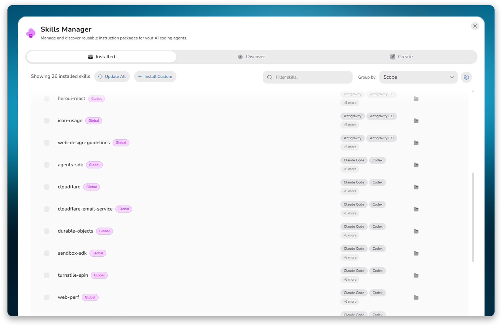
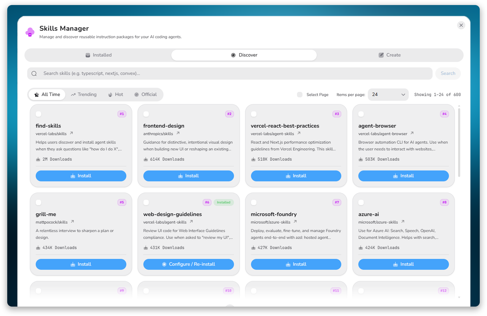
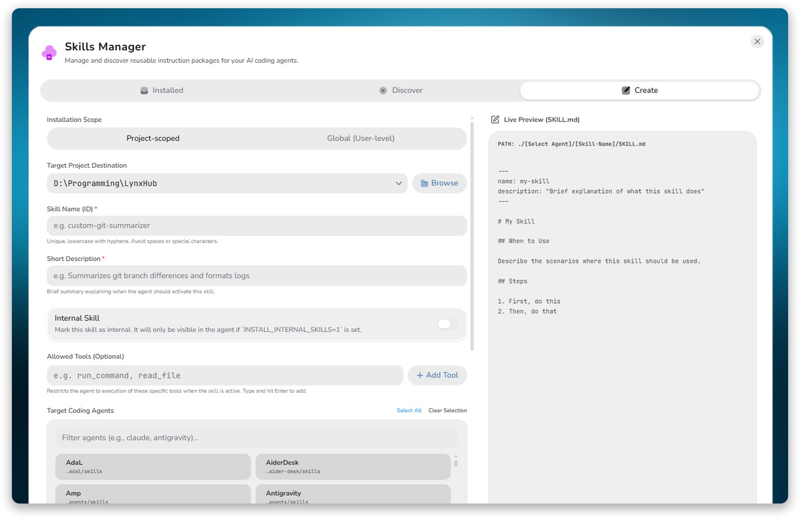

# 🛠️ LynxHub Skills Manager

[](https://opensource.org/licenses/MIT)
[](https://github.com/KindaBrazy/LynxHub)
[](https://skills.sh)

An interactive, feature-rich GUI management extension for **AI Coding Agent Skills** built with **HeroUI v3** and **Tailwind CSS v4**. It wraps the `skills` NPM CLI, integrating with the [skills.sh](https://skills.sh) registry to discover, install, update, audit, and author custom instruction packages for agents like **Antigravity**, **Claude Code**, **Cursor**, and more.

---

## ✨ Key Features

- **📦 Local & Global Skill Management**
  - List all installed skills, grouped by parent directory, target scope (Project-scoped or Global), or targeted agents.
  - Supports bulk actions for batch updating, uninstalling, or scoped grouping.
- **🔍 Live Registry Discovery**
  - Stream and parse leaderboards (_Trending_, _Hot_, _All-Time_) and official creators directly from [skills.sh](https://skills.sh).
  - Instant search queries against the registry to search for available packages.
- **🛡️ Automated Security Audits**
  - Fetch live safety audits (passes/warnings/failures) for registry packages before committing to installation.
  - Displays auditing provider reports and risk summaries dynamically.
- **⚡ Visual Skill Creator Wizard**
  - An interactive wizard to author new custom skills files with ease.
  - Configures name validation, internal flags, allowed-tools, and scoping preferences.
  - Guided step authoring with structured inputs (When to Use, Steps list) or raw Markdown input.
- **⚙️ Multilayer Scope Configuration**
  - Install skills locally into standard project-specific folders (`.agents/skills`) or globally (`~/.agents/skills`).
  - Select and manage custom directories to load project skills from.

---

## 📦 Installation

To use this extension, follow these steps:

1. **Install LynxHub**: Download and install the main [LynxHub](https://github.com/KindaBrazy/LynxHub) application.
2. **Navigate to Plugins**: Open the LynxHub app and go to the **Plugins** page.
3. **Select & Install**: Find and select **LynxHub Skills Manager** from the list, then click install.
4. **Restart**: Restart the LynxHub application to apply the changes.

---

## 📸 Interface Preview

### 1. Installed Skills & Custom Groups



### 2. Live Registry & Audits



### 3. Interactive Skill Creator



---

## 🛠️ Tech Stack

- **Core Logic**: TypeScript, Node.js, Electron IPC.
- **UI Components**: [HeroUI v3](https://heroui.com/) (`@heroui/react`) combined with Tailwind CSS v4.
- **Icons**: Primary icons from `@solar-icons/react-perf`, fallback and brand icons from `lucide-react`.
- **Build/Bundling**: `electron-vite` with Module Federation configurations.

---

## 🚀 Setup & Development

To develop and test the extension locally:

1.  **Clone into host application extension path**:
    Clone this repository directly into the `/extension` directory at the root of the LynxHub host application:
    ```bash
    git clone https://github.com/KindaBrazy/LynxHub-Skills-Toolkit extension
    ```
2.  **Run host application in development**:
    ```bash
    npm run dev
    ```
    The application will automatically detect the `/extension` directory and load the extension's renderer federated entry and main process hooks.
3.  **Run static validation**:
    To format files and run typechecking:
    ```bash
    npm run validate:ext
    ```
